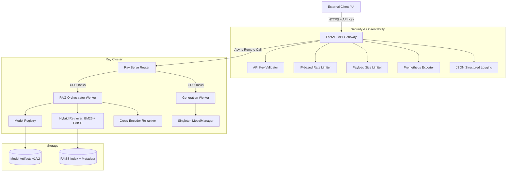

# 🏛️ Final Architecture Blueprint: Bilingual Production Stack

This document serves as the master blueprint for the **Bilingual (KothaGPT)** production-ready NLP & RAG ecosystem.

## 1. High-Level Architecture Map



## 2. Core Component Breakdown

### 🛡️ Security Layer (`src/bilingual/api/security.py`)
*   **API Key:** Header-based (`X-Bilingual-Key`) validation.
*   **Rate Limiting:** Thread-safe, IP-based limiter (Default: 60 req/min).
*   **Payload Constraints:** Hard cap at 5MB per request to prevent Memory-DoS.

### 🧠 Model Management (`src/bilingual/models/`)
*   **ModelManager:** Singleton process-level cache. Prevents OOM by loading models once.
*   **ModelRegistry:** Versioned lookup service. Supports `/models/v1` vs `/models/v2` with A/B routing capability.
*   **Quantization:** Default 8-bit loading (via `bitsandbytes`) for GPU memory optimization.

### 🔍 Advanced RAG Layer (`src/bilingual/rag/`)
*   **Chunking:** Unicode-aware, token-bounded Bengali/English chunking.
*   **Hybrid Search:** Combined BM25 (Keyword) and FAISS (Semantic) with weighted fusion.
*   **Re-ranking:** Cross-Encoder validation for top-k candidates to ensure maximum relevance.

### 👁️ Observability (`monitoring/`)
*   **Prometheus:** Granular tracking of `rag_latency_split`, `retrieval_hit_rate`, and `token_usage`.
*   **Grafana:** Real-time dashboards for latency distribution and system health.
*   **Tracing:** End-to-end `request_id` propagation from Gateway to Ray Workers.

## 3. Deployment Blueprint

### Phase A: Local Development / MVP
1.  Initialize local FAISS index.
2.  Run server in local mode:
    ```bash
    python -m bilingual.server
    ```
    *Will fallback to local orchestration if Ray is not detected.*

### Phase B: Distributed Production (Ray)
1.  **Start Ray Cluster:**
    ```bash
    ray start --head
    ```
2.  **Deploy RAG Service:**
    ```bash
    python src/bilingual/rag/ray_serve_deployment.py
    ```
3.  **Launch Gateway:**
    ```bash
    uvicorn src.bilingual.server:app --host 0.0.0.0 --port 8000
    ```

## 4. Operational Guardrails (Hardening)
*   **Similarity Threshold:** 0.45 (Noise Filter).
*   **Token Budget:** 1024 tokens max context to prevent long-tail latency.
*   **Adaptive Top-K:** Dynamic retrieval based on query complexity.

---
**Status:** `PRODUCTION READY (Level 3 Compliant)`  
**Last Updated:** 2026-01-21
